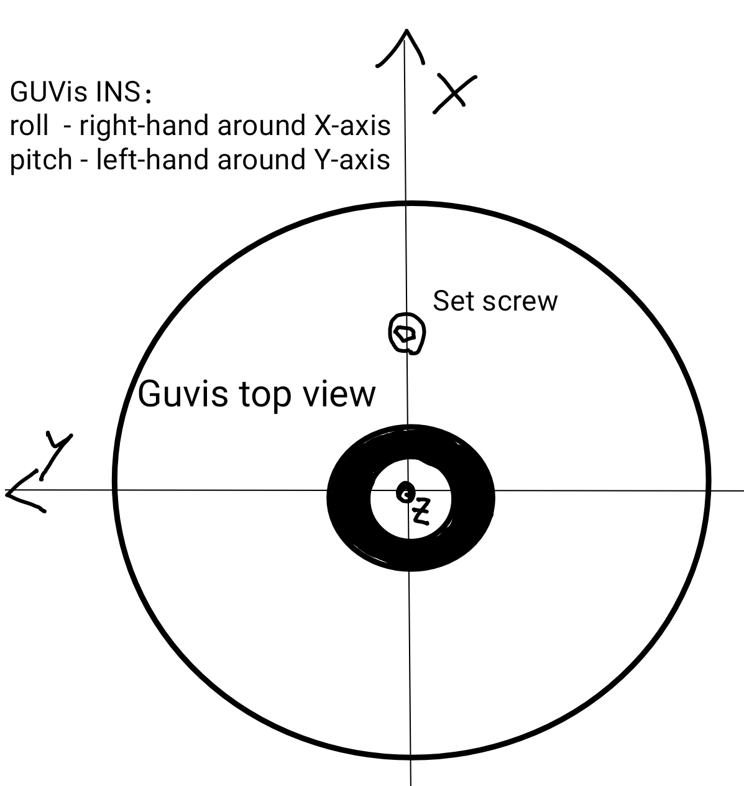
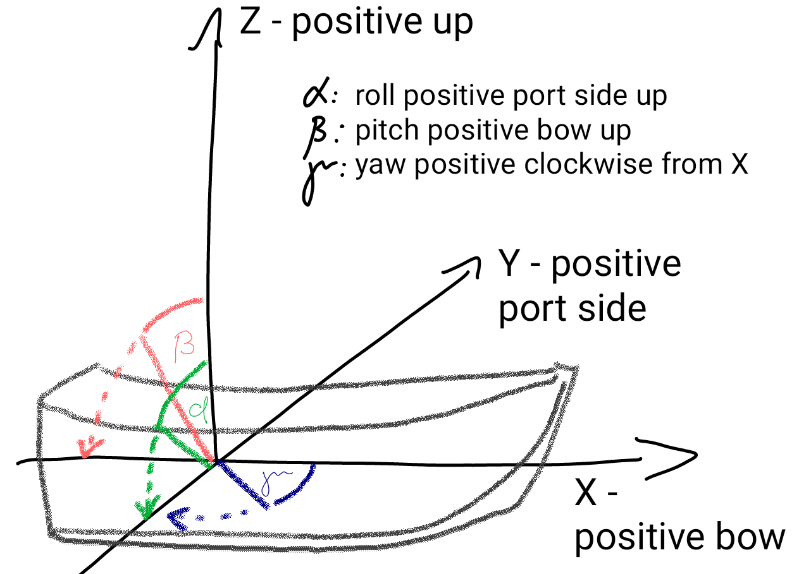
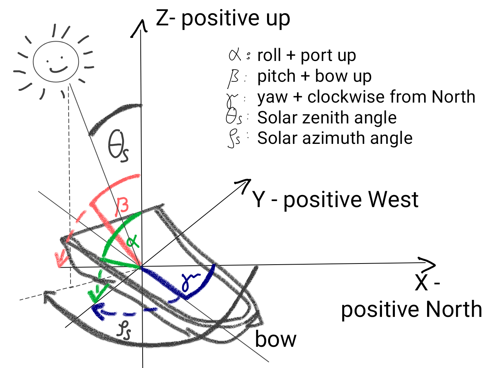

# Definitions
(sec-def-coords)=
## Coordinate Systems, Angles and Rotation
To describe the position and movement of the platform (ship) and GUVis this definition of angles and coordinate system is used:
* **roll**: positive if portside is up
* **pitch**: postive if bow (fore) is up
* **yaw**: positive clockwise from north (its called *yaw* throughout shrad-pro, similar to naming in [HYDRINS](https://spaces.awi.de/download/attachments/183566397/HYDRINS_QuickStartGuide.pdf?version=3&modificationDate=1602162274472&api=v2) ships navigation system, but really its the **heading**)
* **guvis-aligned-coordinate-system**:
  * X-axis points to set screw (top of the instrument, next to the diffuser)
  * Y-axis points to left (looking in x-axis direction)
  * Z-axis points up
* **heading-aligned-coordinate-system**:
  * X-axis points to bow of the ship
  * Y-axis points to port side of the ship
  * Z-axis points up
* **north-aligned-coordinate-system**:
  * X-axis points to North
  * Y-axis points to West
  * Z-axis points up
* **Rotations**:
  * Order: Roll,Pitch,Yaw
  * **roll** : right-hand rotation around x-axis
  * **pitch** : left-hand rotation around y-axis
  * **yaw** : left hand rotation around z-axis

### GUVis aligned coord system:

### Heading aligned coord system:

### North aligned coord system:
